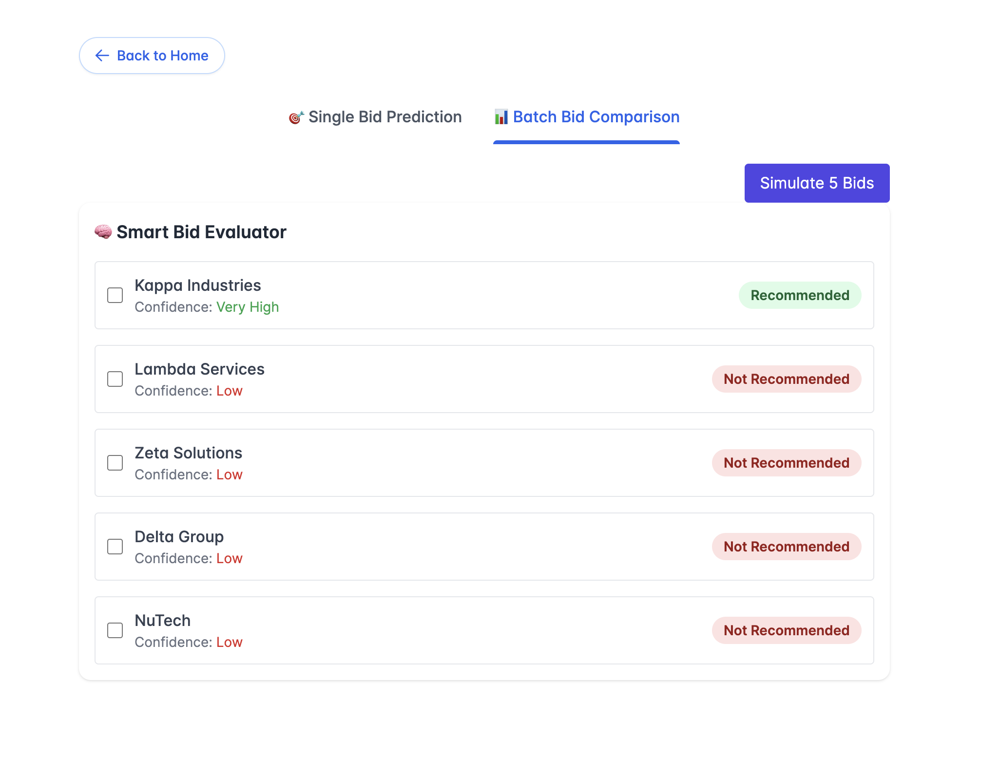
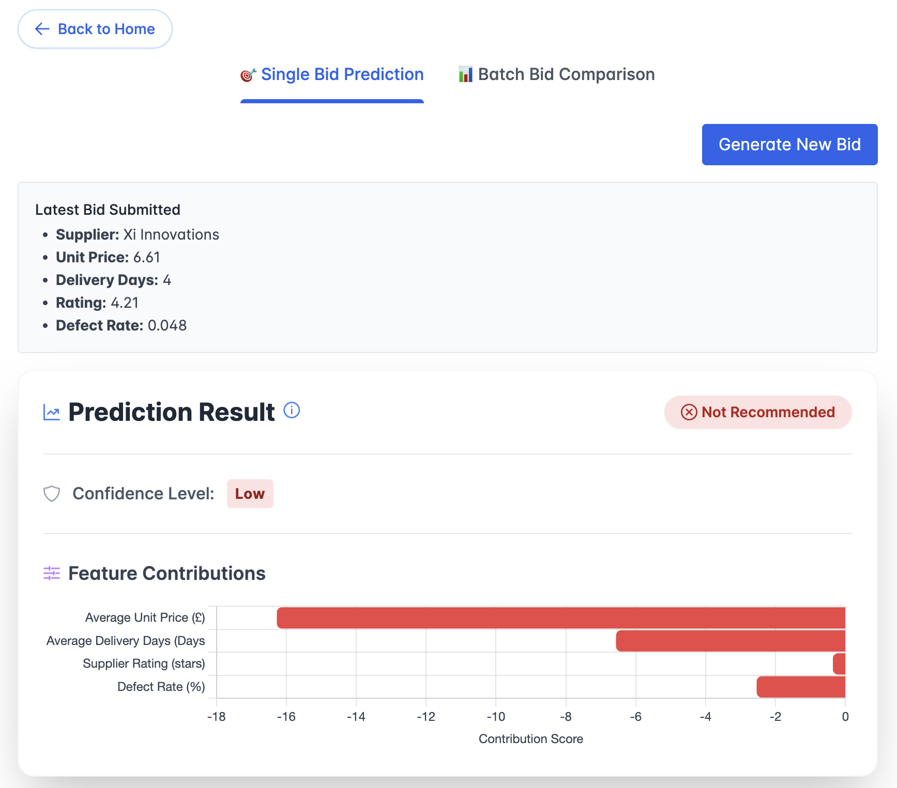

# 🧠 Smart Procurement Assistant

An explainable AI-powered tool to evaluate and compare supplier bids based on key procurement KPIs like unit cost, delivery time, ratings, and defect rates. This full-stack solution integrates:

- 🐍 FastAPI (Python) for ML predictions  
- ⚙️ ASP.NET Core API for orchestration  
- 🌐 Angular frontend for bid simulation and result visualization  

---

## 🚀 Features

- 🎯 Predict whether a supplier bid is optimal (Single Bid Mode)  
- 📊 Compare multiple bids side-by-side (Batch Comparison Mode)  
- 🔍 Visualize feature contributions using EBM explainability  
- ✅ FastAPI + ASP.NET + Angular integration  
- 📦 Containerized backend via Docker Compose  

---

## 🧱 Project Structure

```
smart-procurement/
├── aspnet-backend/       # ASP.NET Core API (talks to ML service)
├── fastapi-ml/           # Python FastAPI service with ML model
├── angular-frontend/     # Angular UI (not containerized)
├── docker-compose.yml    # Compose file for backend services
└── README.md             # This file
```

---

## 🧰 Requirements

- [Docker](https://www.docker.com/)  
- [Node.js & npm](https://nodejs.org/)  
- Angular CLI:  
  ```bash
  npm install -g @angular/cli
  ```

---

## ⚙️ Setup Instructions

### 1. 🐳 Start Backend Services (API + ML)

From the project root:

```bash
docker-compose up --build
```

This will:

- Start **FastAPI ML service** at `http://localhost:8000`
- Start **ASP.NET Core API** at `http://localhost:5001`

Make sure ports `8000` and `5001` are available on your machine.

---

### 2. 🌐 Run the Angular Frontend

```bash
cd angular-frontend
npm install
ng serve
```

Then open [http://localhost:4200](http://localhost:4200) in your browser.

> The Angular app assumes the backend API runs on `http://localhost:5001`.  
> If you change this, update the `environment.ts` file.

---

## 🧪 API Endpoints

| Service       | Endpoint                 | Description                          |
|---------------|--------------------------|--------------------------------------|
| FastAPI (ML)  | `POST /predict`          | Predict for a single supplier bid    |
| FastAPI (ML)  | `POST /bulk-predict`     | Predict for a batch of bids          |
| ASP.NET Core  | `POST /api/predict`      | Forwards to FastAPI `/predict`       |
| ASP.NET Core  | `POST /api/bulk-predict` | Forwards to FastAPI `/bulk-predict`  |

---

## 📊 Model Details

- Model: **Explainable Boosting Machine (EBM)** using `interpret`  
- Wrapped in `CalibratedClassifierCV` for improved probability outputs  
- Output includes per-feature **logit contributions** for transparency  

---

## 📘 Example Screens





---

## 🧑‍💻 Author

Built by **Ayomide Adekoya**  
[View on GitHub](https://github.com/your-username/smart-procurement)

---

## 📝 License

MIT — free to use, modify, and distribute.
